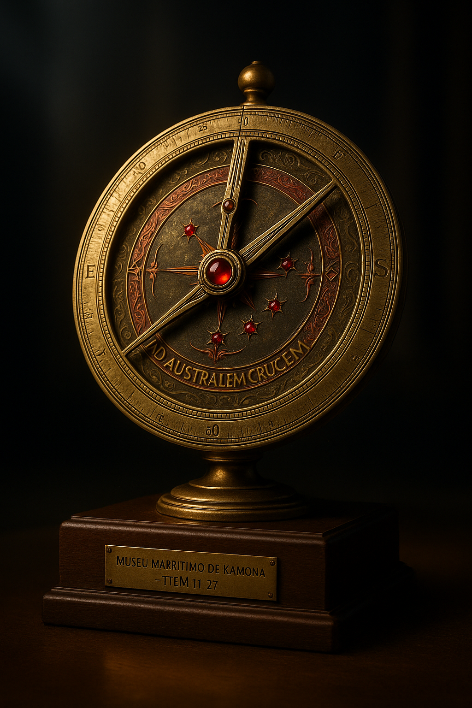
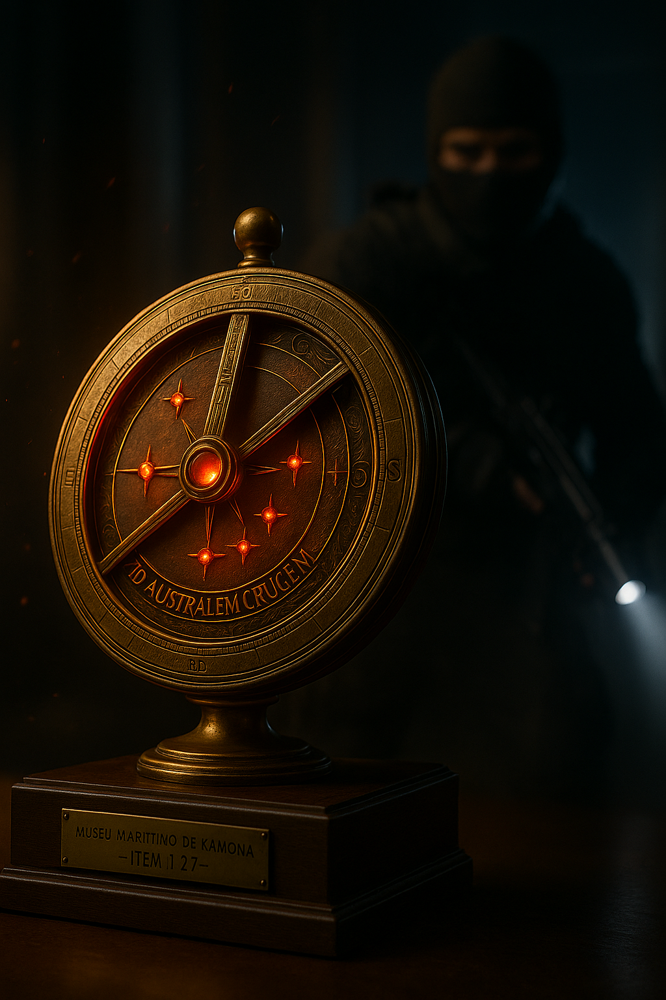

# ⚓ Astrolábio do Cruzeiro do Sul – Proposta de Item "Red" para Arena Breakout

## 📖 Contexto Cultural

Instrumento de navegação usado pelos navegadores luso-brasileiros para ler o **Cruzeiro do Sul** e cruzar o Atlântico. Este exemplar cerimonial combina latão gravado com pigmento **urucum** dos povos amazônicos e **rubis** alinhando as estrelas — um tributo ao encontro entre saberes indígenas e a era das grandes navegações. Diz a lenda que, apontado ao céu, o disco “sangra luz vermelha” indicando o caminho de volta.

---

## 🎨 Design do Item

### Aparência

Um astrolábio cerimonial de **latão envelhecido**, com superfície rica em pátina e detalhes minuciosamente gravados. No centro, uma rosa dos ventos estilizada sustenta a constelação do **Cruzeiro do Sul**, marcada por cinco rubis incrustados que brilham em vermelho intenso. As bordas trazem inscrições em latim e símbolos náuticos, com acabamento artesanal que transmite séculos de história. A peça é exibida sobre uma base de madeira escura com plaqueta dourada de museu.

### Materiais

* **Latão patinado**: corpo principal, com tom dourado envelhecido.
* **Pigmento carmim (urucum)**: preenchendo as inscrições e gravuras.
* **Rubis vermelhos**: cinco gemas pequenas que marcam as estrelas do Cruzeiro do Sul.
* **Madeira nobre**: base de exposição, polida e sóbria.
* **Plaqueta dourada**: inscrição “Algum contexto vinculado ao jogo”.

### Efeitos Especiais (in-game)

* **Brilho interno difuso**: inscrições e rubis emitem uma luz vermelha suave, pulsando em sincronia.
* **Halo carmesim**: reflexos vermelhos percorrem discretamente as gravações.
* **Partículas suspensas**: pequenas partículas douradas criam uma aura mística.
* **Som ambiente sutil**: ao inspecionar, emite som metálico ecoante de engrenagens antigas.

---

## 🖼️ Galeria de Imagens

### Hero Shot – Item Isolado

### Ângulo Detalhado / Vista Lateral

---

## 🚀 Justificativa

Este design mistura **autenticidade histórica**, **luxo colecionável** e um **efeito místico único**, alinhado ao valor supremo dos “Reds” no jogo. Sua silhueta icônica e aura lendária fazem dele um item ideal para ser exibido no Trophy Room do Arena Breakout.
